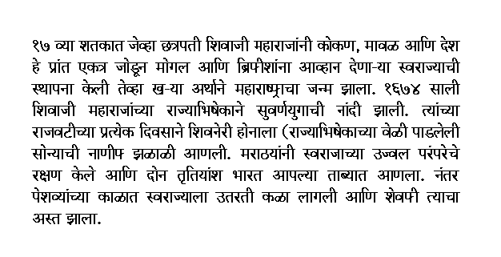
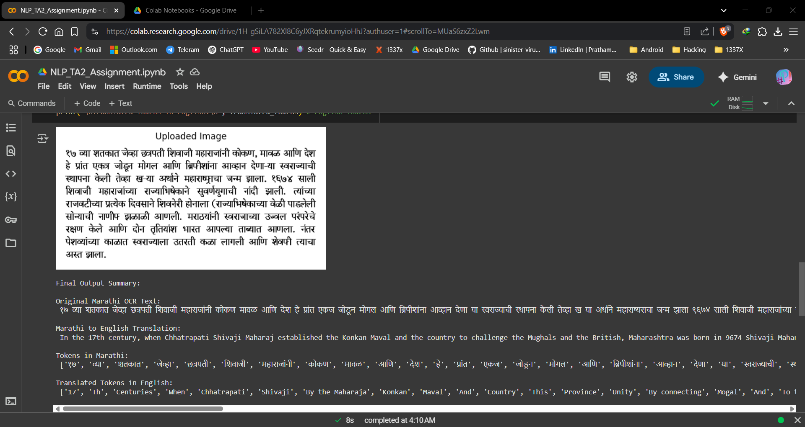

# 📝 Marathi Handwritten Text Recognition using OCR + NLP

---

## 📌 Project Overview

This project implements handwritten text recognition using **OCR (Optical Character Recognition)** and **NLP (Natural Language Processing)** techniques, focusing on **Marathi** script. It allows users to upload handwritten Marathi text images, extract and clean the text, then perform NLP tasks like **tokenization** and **translation**.

> 🧾 **Subject Code:** CTMTAIDS SII P3  
> 📘 **Subject Name:** Natural Language Processing  
> 🎓 **Course:** M.Tech in Artificial Intelligence & Data Science (Specialization in Cybersecurity)  
> 🏛️ **Institute:** National Forensic Sciences University (NFSU), Gandhinagar  
> 📝 **Assignment:** TA2 – Handwritten Text Recognition in Native Language

---

## 🚀 Features

- 📸 Upload or fetch handwritten Marathi text images
- 🧼 Image preprocessing with OpenCV
- 🔎 OCR using Tesseract (Marathi language support)
- 🧠 NLP processing with Indic NLP Library
- 🌍 Translation using Deep Translator
- 📊 Tabular output view of tokens

---

## 🛠️ Tools & Technologies

- **Python 3.10+**
- **Jupyter/Google Colab**
- **Tesseract OCR + Marathi Language Pack**
- **OpenCV**
- **PIL (Pillow)**
- **Indic NLP Library**
- **Deep Translator / Google Translate API**
- **Matplotlib & Pandas**

---

## 📁 Repository Files

| File                          | Description                               |
|-------------------------------|-------------------------------------------|
| `NLP_TA2_Assignment.ipynb`    | Full Colab notebook with implementation   |
| `NLP_TA2_Assignment.py`       | Python script version of the notebook     |
| `NLP_TA2_Assignment_Output.png` | Final output screenshot                  |
| `marathi_test_img_1.png`      | Sample Marathi handwritten image          |

---

## ▶️ Run on Google Colab

Click the badge below to open the notebook in Google Colab:  

---

## 🖼️ Input Image

## 📌 Result Preview

---

## 📜 License

This project is licensed under the **GNU GPL v3**. See the [`LICENSE`](LICENSE) file for details.

---

## 🙌 Acknowledgements

- [Tesseract OCR](https://github.com/tesseract-ocr/tesseract)
- [Indic NLP Library](https://anoopkunchukuttan.github.io/indic_nlp_library/)
- [Deep Translator](https://pypi.org/project/deep-translator/)
